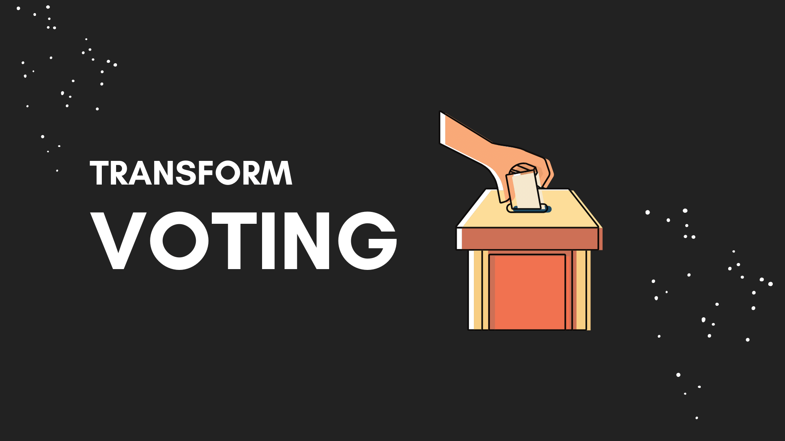

<p style="text-align:center;">
  
</p>

# ⚙️ dvote-polygon

#### dvote-polygon is a typescript library integrated into the     [polygon] (https://polygon.technology/) network.

###### This library is tested on the polygon Mumbai test network using [quicknode](https://www.quicknode.com/) provider.
###### This library is tested on [Ganache](https://trufflesuite.com/ganache/), which is a personal Ethereum blockchain.


### Installation
##### type this command in CMD or Terminal
```bash
   npm i dvote-polygon
```

## Usage
##### First Set your Private Key in Dotenv
```env
PRIVATE_KEY = YOUR_PRIVATE_KEY_OF_CRYPTO_WALLET_ADDRESS
```

### Import the Class
```js
import {Dvote}  from "dvote-polygon";
```

### Create New Instance
##### params => endpointUrl:string , renewContract:boolean
##### second parameter is false by default and it could be true if you want to deploy new contract! you can leave it blank if you want to use previous contract.
```js
const endpointUrl = "http://127.0.0.1:8545" // your provider

const dv = new Dvote(endpointUrl, renewContract) // create new instance
```

### Compile Vote.sol Contract
##### params => abi:Array<JSON>, bytecode:string
```js
let abi = dv.compile().abi()
let bytecode = dv.compile().bytecode()
```

### Deploy Contract
##### params => abi:Array<JSON>, bytecode:string
```js
dv.deploy(abi, bytecode).then(data=>{

  result = data;

})
```

### Create a Poll
##### params => ballotName:string, voteOptions:string[]
```js
let ballotName = "EBAY-SCORES"
let voteOptions = ["Perfect", "Good", "Bad", "Worst"]

dv.createVote(voteName, voteOptions).then(data=>{

  result = data;

})
```

### Add Vote
##### params => fromAddress:string, ballotName:string, voteOption:string
```js
let fromAddress = "any User Wallet Address"
let ballotName = "EBAY"
let voteOption = "Perfect"

dv.addVote(voteName, voteOption, fromAddress).then(data=>{

   result = data;
    
})
```

### Change your Vote
##### you can change your casted vote to another option
##### params => fromAddress:string, ballotName:string, newOption:string
```js
let fromAddress = "any User Wallet Address"
let ballotName = "EBAY"
let newOption = "Good"

dv.changeVote(ballotName, newOption, fromAddress).then((data:any)=>{

    result = data;

})
```

### Vote Result
##### show the result of voting
```js
let ballotName = "EBAY"

dv.voteResult(ballotName).then((data:any)=>{

    result = data;

})
```

### contribution
If you are interested in contributing to this project, I will be very glad ^__^

### License
MIT

